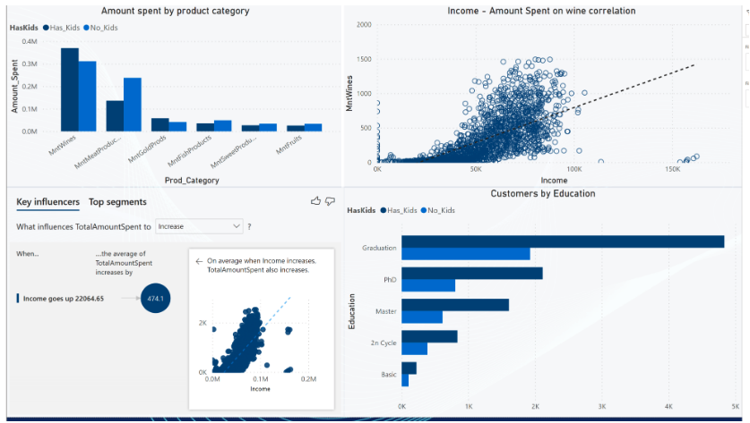
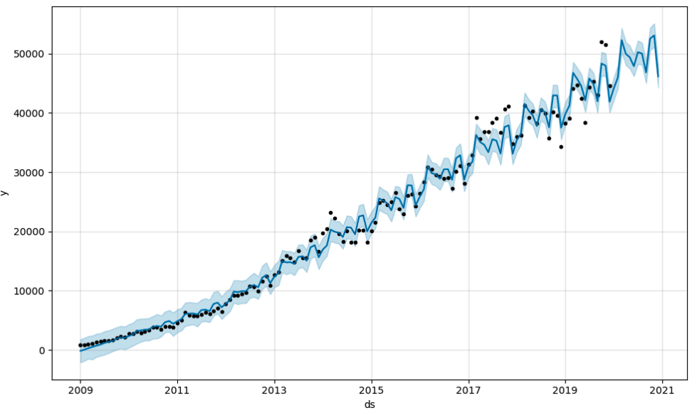
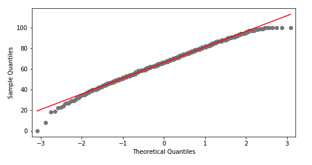
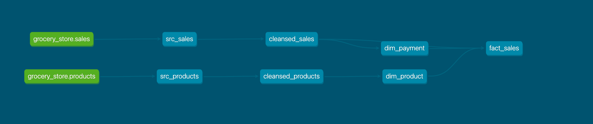

### Welcome to Felix's Gitlab Profile 👋

<!--
**felixs7/felixs7** is a ✨ _special_ ✨ repository because its `README.md` (this file) appears on your GitHub profile.

Here are some ideas to get you started:

- 🔭 I’m currently working on ...
- 🌱 I’m currently learning ...
- 👯 I’m looking to collaborate on ...
- 🤔 I’m looking for help with ...
- 💬 Ask me about ...
- 📫 How to reach me: ...
- 😄 Pronouns: ...
- ⚡ Fun fact: ...
-->

My Gitlab repo contains some private projects around different topics I find interesting. Here is a short overview:

**Marketing Analytics**

  - Demo project to descriptively analyse marketing data for a fictitious company. Project contains a single, relatively clean dataset that is stored in a SQL database.
  - SQL Stored Procedure to setup database and clean reporting table
  - Power BI Dashboard connecting to reporting table
  - Topics: SQL, Power BI
  

  
**Stackoverflow Time Series Analysis**
  - Project using Facebook's Prophet library  to forecast the number of questions asked on Stackoverflow in a given month.
  - Topics: Python, Docker, Prophet, Time-Series Forecasting
  
  
**Student Performance Analysis**
  - Exploratory Data Analysis using Python and Jupyter Notebook. The goal is to get insights on Student Performance and analyse key factors for successful exam scores. 
  - Topics: Exploratory Data Analysis (EDA), Statistical Inference, Machine Learning
  
 
 **Grocery Store ELT Pipeline in dbt**
  - Project using dbt to build a Data Warehouse with 2 dim and 1 fact table based off 2 transactional source tables
  - Topics: dbt, Data Warehousing, SQL, Snowflake
  
