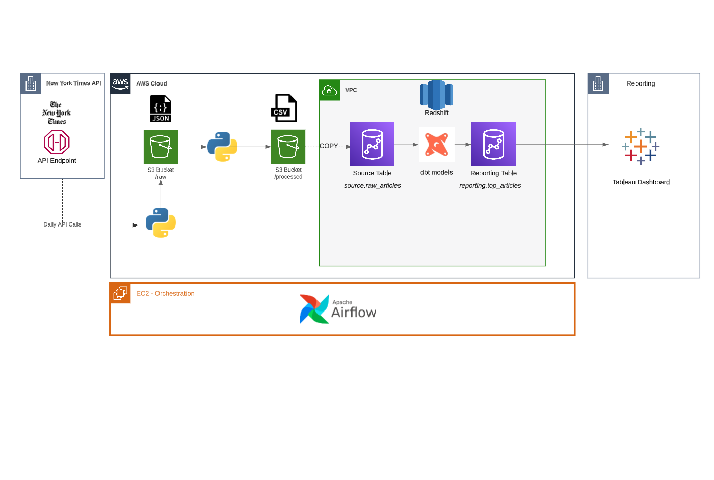
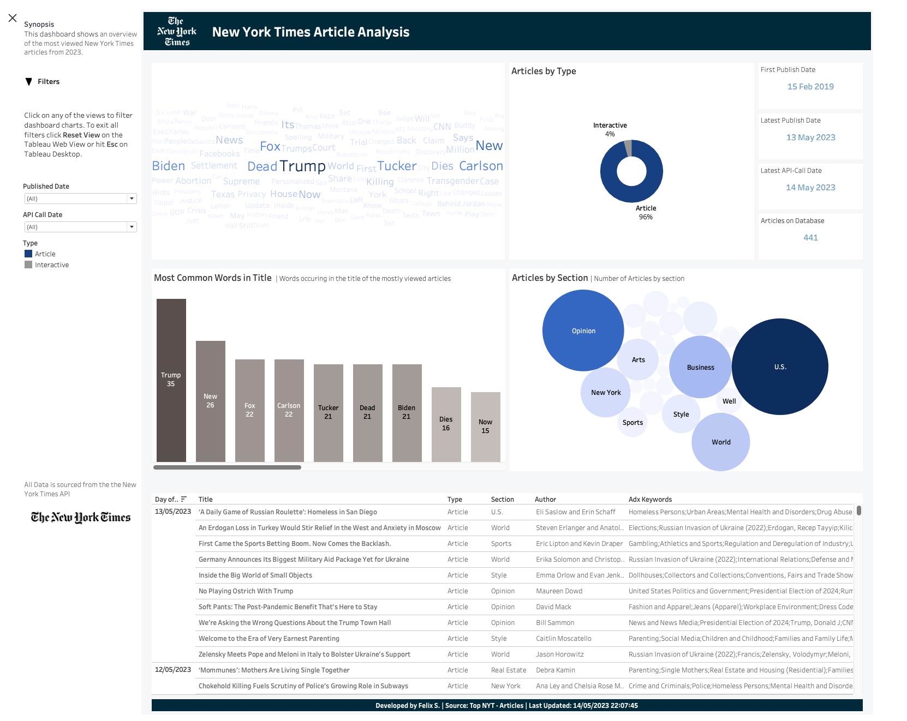
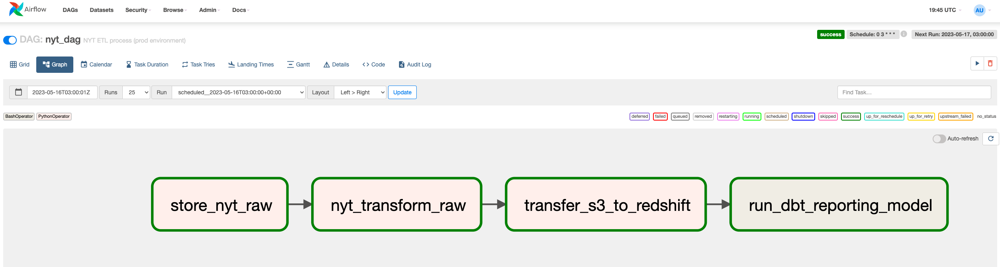

### Welcome to Felix's Gitlab Profile 👋

<!--
**felixs7/felixs7** is a ✨ _special_ ✨ repository because its `README.md` (this file) appears on your GitHub profile.

Here are some ideas to get you started:

- 🔭 I’m currently working on ...
- 🌱 I’m currently learning ...
- 👯 I’m looking to collaborate on ...
- 🤔 I’m looking for help with ...
- 💬 Ask me about ...
- 📫 How to reach me: ...
- 😄 Pronouns: ...
- ⚡ Fun fact: ...
-->

My Gitlab repo contains some private projects around different topics I find interesting. Here is a short overview:

The latest project I've been working on is an example of a full end-to-end analytics pipeline using modern cloud technologies. 
It shows my technical ability around Data Preprocessing using Python, dbt, Airflow, and AWS services such as Redshift, EC2 and VPCS as well as Data Visualisation skills using Tableau as the BI-tool.

**New York Times Articles ETL using Airflow, S3, Python, dbt and Redshift and Ubuntu (hosted on EC2) **
- Project demonstrates a practical ETL pipeline to extract daily article data from the New York Times API
- It extracts daily article data from the New York Times API, performs transformations, and stores the data in an S3 bucket.
- The data is then loaded into Redshift, and a dbt model creates a reporting view for analysis.
- The pipeline is orchestrated using Airflow, running on an Ubuntu EC2 instance.
- The solution follows best practices for data engineering and supports both production and QA environments with separate S3 buckets and Redshift databases.

**Marketing Analytics**

  - Demo project to descriptively analyse marketing data for a fictitious company. Project contains a single, relatively clean dataset that is stored in a SQL database.
  - SQL Stored Procedure to setup database and clean reporting table
  - Power BI Dashboard connecting to reporting table
  - Topics: SQL, Power BI
  

  
**Stackoverflow Time Series Analysis**
  - Project using Facebook's Prophet library  to forecast the number of questions asked on Stackoverflow in a given month.
  - Topics: Python, Docker, Prophet, Time-Series Forecasting
  
  
**Student Performance Analysis**
  - Exploratory Data Analysis using Python and Jupyter Notebook. The goal is to get insights on Student Performance and analyse key factors for successful exam scores. 
  - Topics: Exploratory Data Analysis (EDA), Statistical Inference, Machine Learning
  
 
 **Grocery Store ELT Pipeline in dbt**
  - Project using dbt to build a Data Warehouse with 2 dim and 1 fact table based off 2 transactional source tables
  - Topics: dbt, Data Warehousing, SQL, Snowflake
  
  

<b>Training Record</b>  
 
I regularly keep myself updated with the latest trends and technologies in the fields of Data Analytics, Data Engineering and Science through various certifications and courses. Below are some example course I have completed:
 
<B>Data Analysis</B> 

•	Certified Data Analyst - Analytics Institute of Ireland 
•	<a href='https://www.credly.com/users/felix-stiefel/badges'>Tableau Analyst & Author</a> 
•	<a href='https://drive.google.com/file/d/15GFbKarqLlYR5jOIpJ8JIrA8e8sYKy7Z/view'>Python & Pandas</a> 
•	<a href='https://drive.google.com/file/d/1ee0ZVVTWdFpnBQsY2ib3Y6-_rXznyfcT/view'>Python A-Z: Python for Data Science</a> 
•	<a href='https://drive.google.com/file/d/11OyqsqaZtm7Bl1sKPnsjJKXOLNgWqI1C/view'>Microsoft Power BI</a> 

<B>Data Science</B> 
•	<a href='https://www.coursera.org/account/accomplishments/verify/DZ566Z4GJSJX'>Machine Learning - Stanford University</a> 
•	<a href='https://www.credly.com/users/felix-stiefel/badges'>EY Badge - Data Science Silver</a> 
•	<a href='https://indeed.udemy.com/certificate/UC-f40c080a-d788-4c9f-a530-3c56d16540dd/?utm_campaign=email&utm_source=sendgrid.com&utm_medium=email'>Time Series Analysis</a> 
•	<a href='https://drive.google.com/file/d/17dTJR7HsHGipdTPL3oOOhJ7r7bthDpVf/view'>R - Advanced Analytics</a> 

<B>Data Engineering & Modelling</B> 
•	<a href='https://indeed.udemy.com/certificate/UC-ccc43d81-8407-41fe-ac2f-f1e83d7dd3d3/?utm_source=sendgrid.com&utm_medium=email&utm_campaign=email'>dbt</a> 
•	Airflow  
•	<a href='https://www.credly.com/users/felix-stiefel/badges'>Alteryx Designer Core Certification</a> 
•	<a href='https://udemy-certificate.s3.amazonaws.com/pdf/UC-96f0d5dc-8ca8-443c-8fc5-7839cdcfb113.pdf'>Data Warehouse</a> 
•	<a href='https://www.credly.com/users/felix-stiefel/badges'>Azure Data Fundamentals</a> 

<B>Software Development</B> 
•	<a href='https://drive.google.com/file/d/11EDF2-b5XPYar0hdns8S3x_YG6U5m0ux/view'>RPA - UiPath - Level 1</a> 

 
